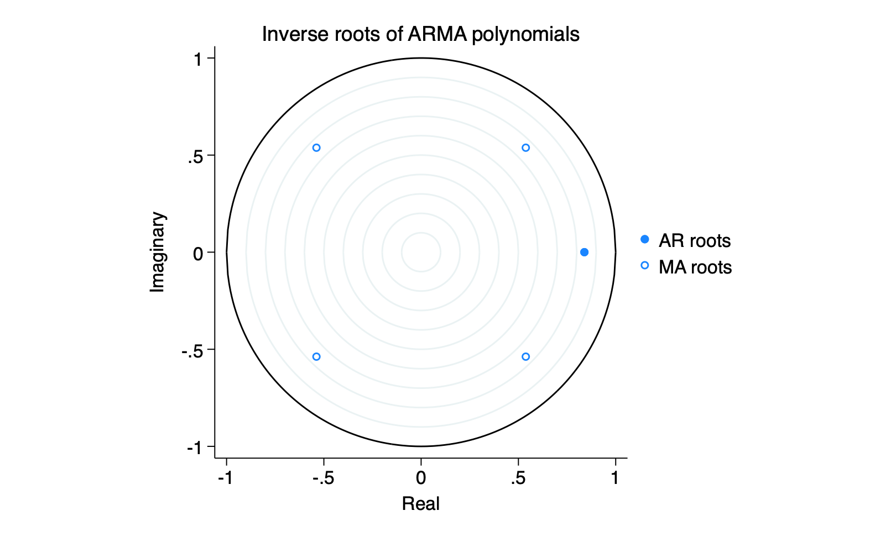

There are stability conditions for the `ar` and `ma` processes that revolve around the roots of the characteristic equations.  The so-called stationarity and invertability conditions.  They are implemented by default in R's arima package but they can be checked with relative ease in both stata and R.

In particular, having estimated an ar process ar(p), the characteristic equations in the slides give a $p^{th}$ order polynomial that we can solve for the charateristic roots.  There is an invertability condition for an ma(q) that gives a $q^{th}$ order polynomial.  After estimating an ARIMA(p,d,q) model, they can be easily checked.  In both cases, the complex roots should lie outside the unit circle.  We more frequently examine the inverse roots and ask whether or not they are **inside** the unit circle.

Taking the British government popularity data

```{r}
library(fpp3)
library(haven)
br7983 <- read_dta(url("https://github.com/robertwwalker/Essex-Data/raw/main/br7983.dta")) %>% 
  mutate(month = as.character(month)) %>% 
  mutate(month = paste0("19",month, sep="")) %>% 
  mutate(date = yearmonth(month, format="%Y%m"))
br7983 <- br7983 %>% as_tsibble(index=date) 
br7983 %>% autoplot(govpopl) + hrbrthemes::theme_ipsum() + labs(y="logged Government Popularity")
```

The best model seems to be ar(1) and sma(4).

```{r}
mod <- arima(br7983$govpopl, order = c(1,0,0), seasonal=list(order=c(0,0,1), period=4))
mod
acf(arima(br7983$govpopl, order = c(1,0,0), seasonal=list(order=c(0,0,1), period=4))$residuals)
pacf(arima(br7983$govpopl, order = c(1,0,0), seasonal=list(order=c(0,0,1), period=4))$residuals)
```

White noise.  Parameters are all likely different from zero.  What about the characteristic roots?

```{r}
forecast::autoplot(mod)
```

Note that these are the inverse characteristic roots.  And all are inside the unit circle.  So this model is stationary and invertible.

What about Stata?

```
. arima govpopl, ar(1) ma(4)

(setting optimization to BHHH)
Iteration 0:  Log likelihood =  40.962134  
Iteration 1:  Log likelihood =  44.723724  
Iteration 2:  Log likelihood =  44.866662  
Iteration 3:  Log likelihood =  45.127431  
Iteration 4:  Log likelihood =  45.434671  
(switching optimization to BFGS)
Iteration 5:  Log likelihood =  45.471498  
Iteration 6:  Log likelihood =  45.472428  
Iteration 7:  Log likelihood =  45.473906  
Iteration 8:  Log likelihood =  45.473963  
Iteration 9:  Log likelihood =  45.474094  
Iteration 10: Log likelihood =  45.474098  

ARIMA regression

Sample: 0 thru 47                               Number of obs     =         48
                                                Wald chi2(2)      =      97.18
Log likelihood = 45.4741                        Prob > chi2       =     0.0000

------------------------------------------------------------------------------
             |                 OPG
     govpopl | Coefficient  std. err.      z    P>|z|     [95% conf. interval]
-------------+----------------------------------------------------------------
govpopl      |
       _cons |   3.488899   .1376348    25.35   0.000      3.21914    3.758658
-------------+----------------------------------------------------------------
ARMA         |
          ar |
         L1. |   .8391349   .0952577     8.81   0.000     .6524332    1.025837
             |
          ma |
         L4. |   .3351339   .1690192     1.98   0.047     .0038624    .6664055
-------------+----------------------------------------------------------------
      /sigma |    .091893   .0090176    10.19   0.000     .0742189    .1095671
------------------------------------------------------------------------------
Note: The test of the variance against zero is one sided, and the two-sided
      confidence interval is truncated at zero.

. estat aroots

   Eigenvalue stability condition
  +----------------------------------------+
  |        Eigenvalue        |   Modulus   |
  |--------------------------+-------------|
  |   .8391349               |   .839135   |
  +----------------------------------------+
   All the eigenvalues lie inside the unit circle.
   AR parameters satisfy stability condition.

   Eigenvalue stability condition
  +----------------------------------------+
  |        Eigenvalue        |   Modulus   |
  |--------------------------+-------------|
  |  -.5380091 +  .5380091i  |    .76086   |
  |  -.5380091 -  .5380091i  |    .76086   |
  |   .5380091 +  .5380091i  |    .76086   |
  |   .5380091 -  .5380091i  |    .76086   |
  +----------------------------------------+
   All the eigenvalues lie inside the unit circle.
   MA parameters satisfy invertibility condition.

```

Notice stata tells you how to interpret the result.



And to reiterate, these conditions establish that either the MA(q) can be inverted to an infinite AR process with declining dependence through time or the AR(p) can be rewritten as an infinite order MA with each shock declining in weight through time.

In R, `polyroot` can be used to obtain the roots.  In this case, for the AR, we obtain

```{r}
1/polyroot(c(1,.839))
```

the condition that $abs(\rho) < 1$

Similarly, the MA

```{r}
1/polyroot(c(1,0,0,0,0.335)) # our MA 4 has 1,2,3 equal zero
```

