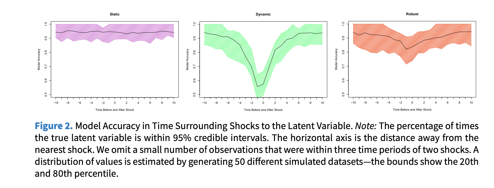

[The PDF](http://cfariss.com/documents/ReuningKenwickFariss2019PA.pdf)

## The Core Problem 

Political scientists increasingly use **latent variable models** to measure unobservable
concepts—ideology, democracy, human rights, transparency.

When applied to **time-series cross-sectional (TSCS)** data, researchers face a fundamental tradeoff:

::: {.columns}
::: {.column width="50%"}
**Static models**

- Minimize bias
- Allow rapid change
- ❌ Ignore temporal structure
- ❌ Lose efficiency
:::
::: {.column width="50%"}
**Dynamic models**

- Model temporal dependence
- Leverage time-series information
- ❌ Over-smooth rapid changes
- ❌ Bias when shocks occur
:::
:::

> **Goal:** A model that handles both stability *and* sudden change.

---

## Static Models

The simplest approach: treat every unit-period as **independent**.

$$\theta_{it} \sim \mathrm{N}(0, 1) \quad \forall i = 1,\ldots,N \;\; \& \;\; \forall t = 1,\ldots,T$$

**How it works**

- Estimates for each unit-period depend *only* on observed manifest variables at that time point
- Allows sudden changes in the latent trait between periods

**Limitations**

- Treats observations as independent → violates temporal structure
- Social science indicators are often coarse or missing
- Results in **wide, uninformative credible intervals** when data are sparse

---

## Dynamic Models

The standard solution: model the latent trait as a **random walk**.

$$\theta_{i1} \sim \mathrm{N}(0,1), \qquad
  \theta_{it} \sim \mathrm{N}(\theta_{i(t-1)},\, \sigma), \qquad
  \sigma \sim \mathrm{HN}(0,3)$$

**Benefits**

- Incorporates temporal autocorrelation as prior information
- Produces tighter (more efficient) credible intervals
- Theoretically sensible when traits are slow-moving

**Critical limitation**

- Smoothing induces **bias near shocks**
- Rapid institutional collapse, elections, coups appear as *gradual transitions*
- Dynamic model performs poorly in the periods surrounding a sudden change

---

## The Robust Dynamic Model

**Key insight:** Replace the Normal transition prior with a **Student's *t* distribution**.

$$\theta_{i1} \sim \mathrm{N}(0,1), \qquad
  \theta_{it} \sim \mathrm{T}_4(\theta_{i(t-1)},\, \sigma), \qquad
  \sigma \sim \mathrm{HN}(0,3)$$

The Student's *t* with **4 degrees of freedom** has heavier tails than the Normal:

- During **stability** → behaves like the dynamic model (efficient, smooth)
- During **shocks** → the heavy tails permit large jumps without over-smoothing

The model retains temporal structure while accommodating extreme values ("outliers" = shocks).

> This is equivalent to the standard dynamic model in the absence of volatility,
> and outperforms it when volatility is present.

---

## Simulation Design

To compare all three models under **known** data-generating conditions:

1. Latent trait $\theta_{i1}$ drawn from $\mathrm{N}(0,1)$
2. Trait follows a **random walk** thereafter
3. With probability *p*, a unit experiences a **shock** — $\theta_{it}$ re-drawn from $\mathrm{N}(0,1)$
4. Binary manifest indicators generated with error from the true latent trait

Models evaluated on:

- 95% credible interval **coverage** around shocks
- Within-unit **rank correlations**
- **Cross-validated accuracy**
- Differences between adjacent time periods

Benchmark parameters: shock probability = 0.01, innovation SD = 0.05.

---

## Simulation Results

::: {.columns}
::: {.column width="60%"}
**For a stable unit (no shock):**

- Static: wide, wandering intervals — *inefficient*
- Dynamic & Robust: tight, well-centred intervals — *equally good*

**For a unit experiencing a shock (period 15):**

- Static: captures the true value but with very wide intervals
- Dynamic: **over-smooths** the jump; misses the true value for several periods
- Robust: tight intervals that **rapidly adapt** to the new level

**Key finding:** The robust model is never worse than the dynamic model, and is substantially better when shocks occur.
:::
::: {.column width="40%"}
{width="100%"}
:::
:::

---

## Application 1 — Judicial Ideology

**Data:** US Supreme Court votes, 1937–2015 (Martin & Quinn 2002)

- Items = individual justice votes (affirm/overturn)
- Original model used a dynamic prior

**Posterior predictive accuracy**

| Model   | Correct Predictions |
|---------|-------------------|
| Dynamic | 72.77%            |
| Robust  | **72.95%**        |

**WAIC** (lower = better fit)

| Model   | WAIC   |
|---------|--------|
| Dynamic | 46,852 |
| Robust  | **46,647** (Δ = 205, SE = 15.6) |

**Substantive finding:** The robust model detects a sudden shift in Rehnquist's voting in 1987—
his first year as Chief Justice—consistent with strategic incentive changes.
The dynamic model smooths this over and misses it entirely.

---

## Application 2 — Democracy

**Data:** Country-year democracy estimates, 1950–2008 (Pemstein, Meserve & Melton 2010)

- 10 ordinal indicators (Polity, Freedom House, Polyarchy, Bollen, Vanhanen, …)
- Original model used a *static* prior

**WAIC comparison**

| Model   | WAIC   |
|---------|--------|
| Static  | 93,267 |
| Dynamic | 79,237 |
| Robust  | **65,082** |

**Substantive findings**

- **Philippines:** Robust model clearly identifies the 1972 imposition of martial law under Marcos
  and the subsequent recovery after 1981 and 1987 — the dynamic model anticipates these
  changes too early and underestimates the abruptness.
- **Afghanistan:** Only the robust model captures the *short-lived* Saur Revolution in 1978
  (quickly followed by the Soviet invasion in 1979) — invisible in the dynamic and static models.

---

## Discussion & Takeaways

**The robust dynamic model is a better default when:**

- The latent trait is subject to punctuated equilibria or sudden regime change
- Researchers want efficiency *and* the ability to detect rapid shifts
- The phenomenon of interest includes institutional collapse, coups, or electoral shocks

**Practical recommendations**

1. Estimate both dynamic and robust models; compare with WAIC and posterior predictive checks
2. Visually inspect well-known historical cases as a validity check
3. Estimate $\sigma^2$ directly from data when possible; sensitivity-test fixed values
4. Be cautious when $\sigma^2 \to 0$: the robust model may artificially detect shocks

**Limitations & future work**

- Change-point models, mixture models, and continuous-time latent variable models are
  complementary alternatives worth exploring
- Causal explanation of detected shocks remains outside the scope of measurement models

---

## Summary

| Feature | Static | Dynamic | **Robust** |
|---------|--------|---------|------------|
| Models temporal structure | ❌ | ✅ | ✅ |
| Efficient (tight intervals) | ❌ | ✅ | ✅ |
| Handles sudden shocks | ✅ | ❌ | **✅** |
| Unbiased near shocks | ✅ | ❌ | **✅** |
| Fit (WAIC — democracy) | worst | middle | **best** |

> Replacing the Normal transition prior with a Student's *t*(4) distribution
> is a simple, theoretically motivated change that substantially improves
> latent variable estimates for politically volatile phenomena—
> **at no cost when the world is stable.**

*Replication code & data:* <https://doi.org/10.7910/DVN/SSLCFF>
